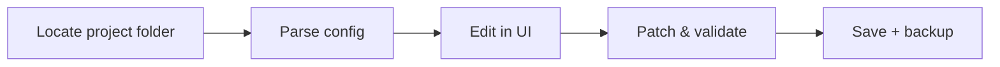

# wallpaper-engine-config-editor

*A small, focused Wallpaper Engine Patcher for people who just want their config files to behave.*

## What this is

wallpaper-engine-config-editor is a Wallpaper Engine Patcher built to fix one specific annoyance: config files that get scrambled, reset, or silently overwritten when you switch wallpapers, update Steam, or move your library to a new drive. Instead of digging through raw JSON by hand, you get a small standalone tool that reads the project.json and scene files Wallpaper Engine actually uses, and patches the values that tend to break.

This started as a weekend project after losing custom slider settings for the third time in a row. There's no big backend, no account system, no telemetry — just a focused editor/patcher that opens your local Wallpaper Engine folder, shows you what's actually stored, and lets you correct it without breaking the file format Wallpaper Engine expects on next launch.

  

The button above opens the project's landing page, where the current build is available for download.

## Who it is for

- **Wallpaper Engine users** who lost custom properties (sliders, colors, toggles) after an update or reinstall.
- **Workshop creators** who need to inspect or repair `project.json` for a wallpaper they published.
- **Multi-PC / multi-drive users** who move their Steam library and end up with broken relative paths.
- **First-time contributors** looking for a small, readable codebase to start with — see the issues tab for good-first-issue tags.
- **Anyone curious about the config format** who wants to poke at it without hand-editing JSON in a text editor.

## What you can do

- **Open and read** any local Wallpaper Engine project folder without needing Steam running.
- **Repair broken references** — fix paths that point to moved or renamed wallpaper folders.
- **Restore default properties** for a wallpaper when a custom preset gets corrupted.
- **Edit sliders, colors, and toggles** through simple form fields instead of raw JSON.
- **Back up a config** before you touch it, with one click, to a local `.bak` file.
- **Compare two config versions** side by side to see exactly what changed.
- **Batch-patch multiple wallpapers** at once when a Wallpaper Engine update resets shared settings.
- **Export a clean project.json** you can hand to someone else or re-upload to Workshop.

## Getting started

1. Visit the [landing page](https://Flintunderbless.github.io/wallpaper-engine-config-editor/) using the download button above.
2. Download the current Windows build (it's a standalone executable, no installer required).
3. Run the `.exe` — Windows may show a SmartScreen prompt since the app is unsigned; choose "Run anyway."
4. Point the tool at your Wallpaper Engine `projects` folder (usually inside your Steam library).
5. Pick a wallpaper, review its config, and patch what needs fixing.

## Requirements

- Windows 10 or Windows 11 (64-bit).
- Wallpaper Engine installed somewhere on the same machine.
- No .NET SDK, Python, or build toolchain needed — it's a single standalone executable.
- Roughly 50 MB free disk space; no admin rights required for normal use.

## How it works

1. The tool locates your Wallpaper Engine project folder (or you point it manually).
2. It parses the project's JSON and scene files into a readable in-app structure.
3. You edit values through the UI — sliders, dropdowns, paths — instead of raw text.
4. On save, the patcher rewrites the file in the exact format Wallpaper Engine expects.
5. An optional backup of the original file is kept alongside it, timestamped.

## FAQ

**Does this replace Wallpaper Engine or need Steam running?**
No. It only reads and writes local config files. Wallpaper Engine itself doesn't need to be open.

**Will patching a config break my Workshop subscription?**
No — it edits local files only. If you resubscribe on Workshop, the original online version stays untouched unless you re-upload from this tool.

**Why did my sliders reset after a Wallpaper Engine update?**
Wallpaper Engine sometimes rewrites `project.json` on update and drops custom values it doesn't recognize. This tool restores them from your last backup or lets you re-enter them quickly.

**Can I use this on wallpapers I didn't create myself?**
Yes, as long as the files exist locally in your projects folder. Be mindful of the original creator's settings before publishing changes.

**Does it work with Wallpaper Engine's Scene or Video wallpaper types, or just Web?**
All three — the parser reads whichever config structure the project type uses.

## Troubleshooting

- **The tool doesn't detect my projects folder.** Point it manually to the folder containing your wallpaper subfolders — usually under your Steam library's `steamapps/workshop/content/431960`.
- **Windows SmartScreen blocks the app.** This happens because the build isn't code-signed. Click "More info" → "Run anyway," or verify the file hash on the landing page.
- **My edits didn't apply in-game.** Fully restart Wallpaper Engine after patching — it caches config in memory and won't reload automatically.
- **A restored backup won't load.** Backups are plain `.json.bak` files; rename the extension back to `.json` before placing it in the project folder.

## License

Released under the [MIT License](LICENSE). This is an independent project, not affiliated with or endorsed by Wallpaper Engine or its developers. Always back up your files before patching, and use at your own discretion.

  

